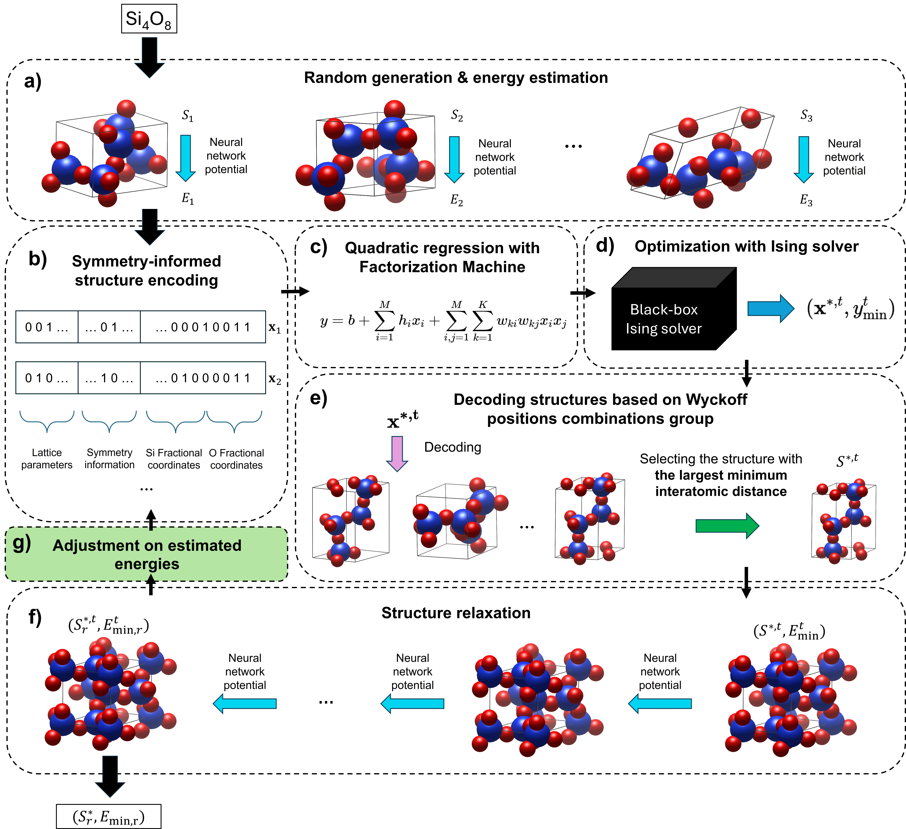

# Introduction
This is CRYSIM (end-to-end CRYstal structure prediction 
with Symmetry-encoded Ising Machine), an optimizer developed
based on Ising machine to address end-to-end crystal structure
prediction (CSP), in which a stable configuration is deducted
only with a chemical formula indicating composition of the
unit cell of the crystal. 
The main idea is to represent crystals in 
the 3D Cartesian space using integer encoding, construct quadratic
relationship between the binary structure vector and its corresponding energy 
(simulating a 2-order potential energy surface), and solve the minimum
of the function using combinatorial optimization tools. Then, 
the solution will be decoded back into a crystal.

Details of the CRYSIM representation and workflow can be found in the 
main manuscript.



The package comprises four parts: encoder and decoder for 
integer encoding, regressor, solver and evaluator.

Encoder and decoder, located at the ```src/onehot``` directory, implement 
the method of encoding crystal information (lattice parameters, symmetry
information, fractional coordinates) using binary vectors and decoding
them into 3D structures.

Regressor, located at the ```src/regressor``` directory, includes 
implementation of 2-order Factorization Machine and its training 
framework by PyTorch. 

Solver, located at the ```src/solver``` directory, includes Ising solvers and 
classical solvers for CSP.

Evaluator, located at the ```src/evaluator``` directory,
implements pretrained universal machine learning potential (MLP) 
used in this work to estimate energy and do structure relaxation.

Optimizers in ```src/optimizer``` directory combine the four portions into 
CSP optimizers that can be directly used. We also provide scripts
for randomly generating structures, and for
evaluating structures generated by 
[CALYPSO](https://www.sciencedirect.com/science/article/pii/S0010465512001762)
and [CRYSPY](https://www.tandfonline.com/doi/full/10.1080/27660400.2021.1943171)
by MLP.

# Installation
In order to reproduce results in the manuscript, using 
[Amplify](https://amplify.fixstars.com/en/) as the
solver and [M3GNet](https://www.nature.com/articles/s43588-022-00349-3)
as the evaluator is necessary. 
```env.yml``` records necessary packages for CRYSIM, which can be
installed using:
```commandline
conda env create -f env.yml
```
The command will create a conda environment named "crysim".
There might be a problem on the version of DGL library for
GPU machines when calling M3GNet. 
In that case, uninstall the default DGL and reinstall it
using:
```commandline
pip install dgl -f https://data.dgl.ai/wheels/torch-2.2/cu118/repo.html
```
For testing with CRYSPY, install the ```csp-cryspy``` package:
```commandline
pip install csp-cryspy==1.2.3
```
For installation and application of CALYPSO, we refer the readers
to its [official website](http://www.calypso.cn/) for more information.

### Acquiring a Token for Fixstars Amplify
In order to run Ising optimization with Amplify, a token for the
client is necessary. 
We refer the readers to its 
[official website](https://amplify.fixstars.com/en/)
for registering an account.
After signing up, a free Fixstarts Amplify AE token can be 
found in [this page](https://amplify.fixstars.com/en/user/token).
Then, Amplify solvers can be used in CRYSIM for CSP
by filling in the ```fae_tk``` variable of the 
```token.yml``` file with the provided
Fixstarts Amplify AE token.

### Other Methods
By default, M3GNet is employed for energy evaluation. 
We also integrate other MLPs that are not discussed in the main
manuscript, including 
[CHGNet](https://www.nature.com/articles/s42256-023-00716-3) and 
[ORB](https://www.orbitalmaterials.com/post/technical-blog-introducing-the-orb-ai-based-interatomic-potential):
```commandline
pip install chgnet==0.3.8
pip install orb-model==0.3.2
```
The methods are implemented in ```src/evaluator/e_eval_chgnet.py``` and
```src/evaluator/e_eval_orb.py```, respectively. 
It is possible to uncomment corresponding lines in
```src/evaluator/e_eval_loader.py```
to run optimization with them.

Besides, [quantum annealer](https://docs.ocean.dwavesys.com/projects/system/en/stable/reference/samplers.html#dwave.system.samplers.DWaveSampler)
and [hybrid annealer](https://docs.ocean.dwavesys.com/projects/system/en/stable/reference/samplers.html#dwave.system.samplers.LeapHybridSampler) 
by [DWave](https://docs.ocean.dwavesys.com/projects/system/en/stable/intro.html) 
are also supported based on API of Amplify. Token for DWave can be 
obtained by registering an account on its 
[official website](https://www.dwavesys.com/). The solvers are available
after filling in ```dw_token``` variable of the 
```token.yml``` file. However, the large sizes of objective functions 
discussed in the main manuscript make it difficult to optimize 
them using the two solvers.

# Submitting Jobs
CSP optimization starts by running ```main_batch.py``` file using 
commend lines.
### 1. Parameter List for Submitting Jobs
Possible parameters are as follows:
```commandline
'-sys', '--system', type=str, 
    chemical formula of the system to be optimized
'-sol', '--solver', type=str, 
    name of the optimizer
'-reg', '--regressor', type=str, default='fm', 
    name of the regressor, useful only for Ising solvers
'-eval', '--evaluator', type=str, default='M3GNet',
    name of the pretrained MLP for as the energy evaluator
'-s', '--seeds', type=int, 
    random seed
'-p', '--precs', type=int, 
    lattice splits number, useful only for Ising solvers
'-n', '--n-steps', type=int, default=300, 
    number of iterations to run
'-t', '--timeout', type=int, default=None, 
    timeout for one step of solving, useful only for Ising solvers
'-f', '--filter-struct', type=bool, default=False, 
    whether or not to do post-processing based on minimum interatomic distances
'-d', '--dist-min', type=int, default=None,
    constraints for minimum distances between genereated atoms, useful only for Amplify API-based solvers
'-w', '--n-wps', type=int, default=1,
    number of sampling when doing post-processing
'--fail-num', type=int, default=1,
    number of the initial structure to be added in the training set when structure relaxation fails
'--follow-dir', type=str, default=None
    directory of output files in the last run, for continuing to train
```
Possible values for ```-sol``` include:
```commandline
'rg': random generation
'hy_bo': simple Bayesian optimization on crystal parameters
'hy_sa': simple simulated annealing on crystal parameters
'amp_c': Amplify with constraints as the Ising solver
'amp_dw_c': DWave with constraints as the Ising solver
'amp_leap_h_c': LeapHybrid with constraints as the Ising solver
```
Possible values for ```-reg``` include:
```commandline
'fm': Factorization Machine
'sim': full-rank quadratic regression
```
Possible values for ```-eval``` include:
```commandline
'M3GNet': using M3GNet as the evaluator
'CHGNet': using CHGNet as the evaluator, only if chgnet is installed
'OrbFF': using ORB as the evaluator, only if orb-model is installed
```
```seed``` and ```precs``` are implemented in appending method, 
so that multiple experiments can be sent at one time.

```dist-min``` adds constraints on the least number of 0-bits between
two 1-bits, which can be helpful for preventing generating structures
containing extremely close atom pairs. However, the implementation 
requires 2-order constraints on objective functions, probably leading
to great computational burden. In the main manuscript, we instead use
post-processing strategy to mitigate the problem, which is controlled 
by ```filter-struct``` and ```n-wps``` parameters in the list.

```fail-num``` represents the number of repititions of the solved 
structure to be added to the training set for the next iteration when
structure relaxation fails on this structure.
If the number is larger than 1, the failure situation is emphasized.
However, relaxation failure does not happen frequently.

```follow-dir``` implements the function of continuing to optimize based 
on the dataset obtained by the last iteration of the last run
in the case of the process is
interrupted.

### 2. Example
Apply BO to predict Y6Co51 system:
```commandline
python main_batch.py -sys Y6Co51 -sol hy_bo
```
Apply CRYSIM-5 
and CRYSIM-7 with "Amplify with constraints" solver to predict 
Y6Co51 system, each of which performs two times with seed 0 and 1:
```commandline
python main_batch.py -sys Y6Co51 -sol amp_c -p 5 -p 7 -s 0 -s 1
```
Apply CRYSIM-15 with "Amplify with constraints" solver to predict
Si96O192 system for three times, sampling 100 structures in 
post-processing of each iteration:
```commandline
python main_batch.py -sys Si96O192 -sol amp_c -p 15 -s 0 -s 1 -s 2 -f True -w 100
```
After finishing 300 iterations using the settings above, continue to train
another 600 iterations starting with the dataset generated during 
optimization with the seed 0:
```commandline
python main_batch.py -sys Si96O192 -sol amp_c -p 15 -s 0 -f True -w 100 --follow-dir ${results_dir} -n 900
```

# Output Files
### 1. Directory of Generated Datasets
Before optimization, random generation is applied to generate by default
1000 configurations to build an initial training set.
The dataset will be saved in ```dataset``` directory with the name:
```commandline
${system}_training${seed}.pkl
```
If the file has already existed, it will be directly loaded.

### 2. Directory of Results Files
After optimization, results will be saved a folder 
in ```results``` directory,
and the name of the folder indicates settings of the experiments:
```commandline
${time of submitting}_${optimizer}_${evaluator}_${system}_s${seed}_n${number of iterations}
```
The ```${optimizer}``` part is composed of ```${encoder}```, 
```${regressor}``` and ```${solver}```.
See "4. Example of Results Directory" for detailed explanations.

Results files in the folder include:
```commandline
- POS_init: generated initial structures in a format of POSCARs
- POS_relaxed: relaxed generated structures in a format of POSCARs
- accumulated-results.pkl
    - 'energy': relaxed energy of all generated structures
    - 'lattice': six lattice parameters for relaxed generated structures
    - 'solved_value': (binary solution, Ising predicted standardized energy) tuples
    - 'spg': space groups of relaxed generated structures, estimated by spglib
    - 'spg_n': space group numbers of relaxed generated structures, estimated by spglib
    - 'init_struct': generated initial structures in a format of pymatgen.core.Structure
    - 'relaxed_struct': relaxed generated structures in a format of pymatgen.core.Structure
- log: log file of the optimization process
- log_status.pkl: numbers of times of calling different functions during optimization
- model/model.pt: trainable parameters of the Ising model after the last iteration
- stat.npz: some metrics on the optimization process
- stat.png: scatter and accumulated lowest energy curve of all relaxed energies
- training_set.pkl: training set generated in the last iteration
```
We note that a successful continuous training requires that the 
```training_set.pkl``` exists in the ```follow-dir``` directory.

### 3. Processing Results Files
In ```src/log_analysis.py```, we provide the ```OutputAnalysis``` class
for conveniently
processing the ```log``` and ```accumulated-results.pkl``` files.

For instance, 
```compare_structure_with_ground_truth``` helps to compare the 
```candidate_num``` stablest structures with the ground truth
using ```pymatgen.analysis.structure_matcher.StructureMatcher```.
Besides, 
```split_energy_struct``` helps to output ```num_struct``` stablest 
structures in a format of POSCAR for visualization.

The class also accepts a list of directories as the input, 
in case of continuous training.


### 4. Example of Results Directory
For instance, the following name:
```commandline
2024-01-01-09-00-00_cpv_hy_bo-t300_M3GNet_Y6Co51_s0_n300
```
means that in the experiment, ```Y6Co51``` is predicted with ```seed```
0 for 300 iterations, using BO (```hy_bo```) on crystal parameter 
vectors (```cpv```). 

```t300``` means that the ```max_eval``` parameter for BO in 
```hyperopt``` is given with the value 300, since in the method, each
evaluation in BO requires structure relaxation for one time.

The following name:
```commandline
2024-01-01-09-00-00_oh-12-None-100-CSSPG_2-fm16_filtering_amp_c-tNone_M3GNet_Si96O192_s0_n300
```
means that in the experiment, ```Si96O192``` is predicted with ```seed```
2 for 300 iterations, using Amplify with constraints solver 
on CRYSIM-12 representation. 

```oh-12-None-100-CSSPG``` describes settings of the encoder for CRYSIM.

```oh-12```means that CRYSIM-12 is applied, in which ```12``` indicates
the adopted lattice splits number is ```12*12*12```.

```None``` means that ```dist-min``` constraints are not added. Otherwise,
the smallest allowed distance will be written here.

```100``` means that ```n-wps``` is assigned with 100.

```CSSPG``` means that both crystal systems and space group numbers
are applied for encoding symmetry information. 

```filtering```
indicates that post-processing is conducted in each iteration. 
Only when ```filtering``` is performed can the ```n-wps``` value be
larger than 1.

```2-fm16``` represents the regressor, in which 
```2``` means that the objective function is quadratic, and 
```16``` indicates the $K$ parameter in Factorization Machine.

For the solver part ```amp_c-tNone```, ```tNone``` means that
the ```timeout``` parameter for Amplify is not indicated, which
is then determined by the number of bits in objective functions.

# Cite
If you find CRYSIM helpful for your research, please consider to cite:
```commandline

```